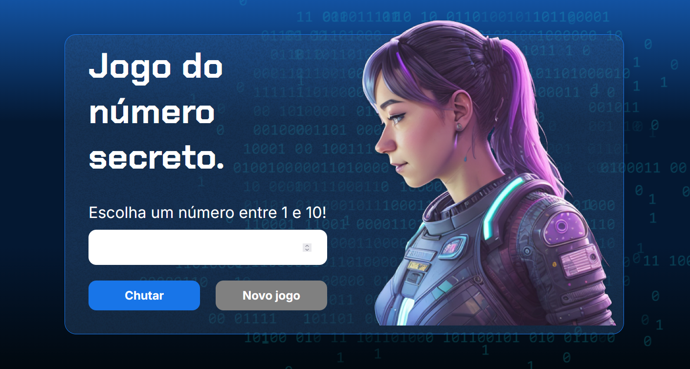

 

# 🕹️ Jogo do Número Secreto

Um jogo interativo de adivinhação desenvolvido durante o curso de Lógica de Programação da Alura. O projeto utiliza JavaScript para manipular o DOM, gerenciar a lógica do jogo e possui integração com sintetizador de voz.

## 🚀 Funcionalidades

* **Adivinhação:** O jogador deve tentar descobrir o número secreto entre 1 e 10.
* **Dicas em tempo real:** O sistema informa se o número secreto é maior ou menor que o chute atual.
* **Sistema de Memória:** O jogo armazena os números já sorteados em uma lista (array) e não os repete até que todas as possibilidades sejam esgotadas.
* **Acessibilidade (VoiceOver):** Integração com a API **ResponsiveVoice.js** para narrar os textos da tela.
* **Responsividade:** Interface adaptada para diferentes tamanhos de tela.

## 🛠️ Tecnologias Utilizadas

* **HTML5**: Estruturação da página.
* **CSS3**: Estilização e layout.
* **JavaScript (ES6)**: Lógica do jogo, manipulação de arrays e recursão.
* **ResponsiveVoice**: Biblioteca externa para sintetização de voz (TTS).

## 🎮 Como Jogar

1. Digite um número entre 1 e 10 no campo de entrada.
2. Clique no botão **"Chutar"**.
3. Siga as dicas na tela para ajustar seu próximo palpite.
4. Ao acertar, você verá o número de tentativas e poderá iniciar um **"Novo jogo"**.

## 💻 Como Visualizar

O projeto pode ser acessado diretamente através do GitHub Pages: 👉 https://raphaelsette.github.io/js-curso-2-aula1/

